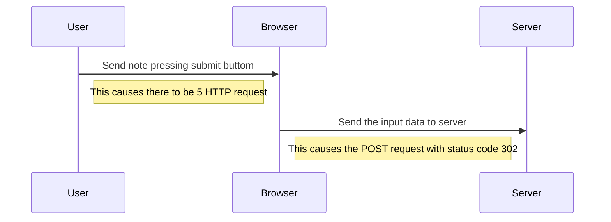

```mermaid
sequenceDiagram
    participant User;
    participant Browser;
    participant Server;
    
    User->>Browser: Send note pressing submit buttom;
    Note right of User: This causes there to be 5 HTTP request;
    Browser->>Server: Send the input data to server;
    Note right of Browser: This causes the POST request with status code 302;
    
    
    
```
